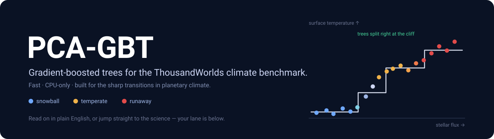

<p align="center">
  
</p>

<p align="center">
  A fast, <b>CPU-only tree baseline</b> for the ThousandWorlds climate-emulation benchmark —
  built for the sharp <i>snowball ↔ temperate ↔ runaway</i> transitions that smooth models blur.
</p>

<p align="center">
  <b>Pick your lane →</b>&nbsp;
  🌱 <a href="#plain-english">Plain English</a> (new here)&nbsp; ·&nbsp;
  🔬 <a href="#for-scientists">For scientists</a> (the astro / ML community)
</p>

---

<a id="plain-english"></a>

## 🌱 Plain English

**The question.** What's the climate like on a planet around another star — its temperature, winds, clouds? The honest way to find out is to run a giant physics **simulation**, which is slow and expensive (hours of supercomputer time per planet).

**The shortcut.** Train a model that looks at a few basic facts about a planet (how much starlight it gets, its air pressure, its CO₂…) and **predicts the climate instantly** — a fast stand-in for the slow simulation. That's what the *ThousandWorlds benchmark* is for, and a **baseline** is one standard method everyone compares against.

**Our baseline, in one breath.** We squeeze a planet's full climate down to a handful of numbers, then predict those numbers with **gradient-boosted trees** — a stack of simple yes/no decision charts where each new chart fixes the previous ones' mistakes. Then we un-squeeze back to a full climate.

**Why trees?** Planet climates have **cliffs**: nudge the starlight a little and a world can flip from a frozen "snowball" to temperate, or tip into a runaway greenhouse. Smooth models *smear* those cliffs; trees can put a decision line **right on the edge** — which is exactly the structure this benchmark has.

**What we just changed (and why).**
- **One clean engine.** We removed two half-finished, untested alternatives and kept the single, well-tested gradient-boosting engine. Fewer moving parts, fewer bugs, a clearer story.
- **Fair self-testing.** Instead of hand-guessing the model's two main dials, we now let the model **choose them itself, per task, using only the training data** (a method called *cross-validation* — you never peek at the test answers). So the scores are honest and reproducible.

**Why it matters.** With one tested engine and the same fair tuning rules the other methods use, this is no longer a rough prototype — it's a legitimate **official baseline** for the benchmark's results table and paper. And it's cheap: it runs on a normal laptop **CPU in seconds-to-minutes**, while the very top methods need a GPU.

**The result, in one line.** It's one of the best methods that *isn't* a heavyweight Gaussian process — in fact the **strongest simple/cheap baseline on the largest task**.

> Want the rigorous version — the equations, the protocol, and the tables? **[Jump to “For scientists” ↓](#for-scientists)**

---

<a id="for-scientists"></a>

## 🔬 For scientists

### TL;DR

ThousandWorlds reports that off-the-shelf deep learning does not yet beat Gaussian processes on this low-data, multi-simulator, parameter→field problem. This contribution adds **PCA-GBT** — gradient-boosted regression trees on the existing PPCA latent representation — a **CPU-only** baseline that, on the two data-rich subsets, is the **best non-GP method on `multi-partial`** (rel 0.534, rank 3/9) and **ties the best deep-learning method on `multi-complete`** (rel 0.526, matching `pca_mlp`), beating or matching every DL baseline at a fraction of the cost (the GP baselines expect CUDA). Only the Gaussian processes (`gplfr`, `ppca_icm`) clearly lead.

`learning_rate` and `max_leaf_nodes` are tuned **per subset** by a 3-fold cross-validation sweep mirroring `pca_ridge` — training folds only, nothing tuned on the test set. It slots into the existing framework with **zero changes** to data loading, PPCA, decoding, or scoring — only the latent-score regressor is swapped — so the comparison is exactly apples-to-apples.


### Why trees

ThousandWorlds climates organise into **regimes** with sharp transitions: temperate → snowball (runaway ice–albedo) and temperate → hot/runaway greenhouse. Across the worlds with a surface-temperature field, global-mean surface temperature spans **≈133–392 K** and splits into distinct populations (snowball < 240 K, temperate, hot > 340 K). These transitions are *threshold-like* in stellar flux, CO₂, etc.

Smooth regressors — ridge, stationary-kernel GPs, MLPs — blur these thresholds. **Axis-aligned tree ensembles partition the parameter space and place splits exactly at the transition boundaries**, the structure this benchmark exposes. The flip side: radiative fields (`asr`, `olr`) vary *smoothly* with stellar flux (corr ≈ 0.87), and there trees staircase and lose to the GPs — a clean, interpretable win/lose characterisation.

### Method

`PCAGBT` (`thousandworlds/models/pca_gbt.py`) reuses the benchmark transforms end-to-end:

1. remove the shared linear trend (same `linear_trend_cfg` as `pca_mlp`),
2. compress the T21 spectral coefficients with the existing PPCA (`fit_ppca`),
3. **regress the 8 planet parameters (+ GCM one-hot) → each PPCA latent score with a `HistGradientBoostingRegressor`** (one per component, fit in parallel),
4. reconstruct fields with the PPCA loadings + linear trend, and score through the unchanged `evaluate.py`.

### Tuning protocol (per-subset CV — the benchmark convention)

`learning_rate` and `max_leaf_nodes` are chosen **per subset** by a **3-fold cross-validation sweep** (objective `equal_group_normalized_rmse`, the same CV machinery and metric as `pca_ridge` / `knn`), over grids `learning_rate ∈ {0.03, 0.05, 0.1}` × `max_leaf_nodes ∈ {15, 31, 63}`. The other settings are fixed (`min_samples_leaf=10`, `l2_regularization=1.0`, `max_iter=600` with early stopping, so the iteration count auto-adapts to subset size). The chosen values, the full grids, and the fold scores are written to each subset's `config.json` (`CV_sweep` + `best`) and replay exactly via `--config`. **The sweep sees only training folds**, so nothing is tuned on the test set.

What it selects is interpretable — small-data wants shallow trees, data-rich tasks afford deep ones:

| subset | train worlds | `learning_rate` | `max_leaf_nodes` |
|---|---|---|---|
| `single-complete` | ~206 | 0.10 | **15** (shallow — guards against overfitting) |
| `multi-partial` | ~1,626 | 0.10 | **63** (deep) |
| `multi-complete` | ~1,538 | 0.10 | **63** (deep) |

### Results

Metric: RMSE per variable, **standard protocol**. `rel` = mean over the 8 variables of (method RMSE / `train_mean` RMSE); lower is better. `surf-T` = surface-temperature RMSE (K). Numbers are read from the checked-in metrics JSON and reproduce from the checked-in `config.json`.

**`single-complete`** (~206 train) — trees competitive with the DL/kNN tier:

| rank | method | type | rel ↓ | surf-T |
|---|---|---|---|---|
| 1 | gplfr | GP | 0.559 | 11.08 |
| 2 | ppca_icm | GP | 0.634 | 11.29 |
| 3 | knn | baseline | 0.655 | 13.41 |
| **4** | **pca_gbt (ours)** | **trees** | **0.659** | **12.14** |
| 5 | pca_mlp | DL | 0.660 | 13.06 |
| 6 | pca_ridge | linear | 0.771 | 14.92 |
| 7 | coord_mlp | DL | 0.790 | 13.94 |
| 8 | coord_deeponet | DL | 0.797 | 16.69 |

**`multi-partial`** (~1,626 train, full benchmark) — **best non-GP method**:

| rank | method | type | rel ↓ | surf-T |
|---|---|---|---|---|
| 1 | gplfr | GP | 0.439 | 10.50 |
| 2 | ppca_icm | GP | 0.499 | 10.73 |
| **3** | **pca_gbt (ours)** | **trees** | **0.534** | **12.83** |
| 4 | coord_deeponet | DL | 0.540 | 13.01 |
| 5 | pca_mlp | DL | 0.540 | 12.73 |
| 6 | coord_mlp | DL | 0.624 | 15.42 |
| 7 | pca_ridge | linear | 0.637 | 16.91 |
| 8 | knn | baseline | 0.666 | 20.54 |

**`multi-complete`** (~1,538 train) — ties the best DL method:

| rank | method | type | rel ↓ | surf-T |
|---|---|---|---|---|
| 1 | gplfr | GP | 0.457 | 11.39 |
| 2 | ppca_icm | GP | 0.512 | 12.05 |
| 3 | pca_mlp | DL | 0.526 | 12.96 |
| **4** | **pca_gbt (ours)** | **trees** | **0.526** | **13.12** |
| 5 | coord_deeponet | DL | 0.536 | 12.50 |
| 6 | pca_ridge | linear | 0.643 | 17.05 |
| 7 | coord_mlp | DL | 0.671 | 20.00 |
| 8 | knn | baseline | 0.704 | 23.17 |

On the two data-rich subsets, PCA-GBT **leads (`multi-partial`) or ties (`multi-complete`)** the non-GP field, beating or matching every deep-learning baseline — at CPU cost (seconds-to-minutes; the GP baselines expect CUDA). The gain is largest where data is richest, as the regime-transition hypothesis predicts.

<details>
<summary><b>Diagnostic figures</b> (click to expand)</summary>

<br>

Climate regimes — a sharp, threshold-like transition in global-mean surface temperature with stellar flux (colour = CO₂); the structure trees exploit:


The climate distribution is multi-modal (distinct snowball / temperate / hot populations):


By contrast, radiative fields vary smoothly with stellar flux — where axis-aligned trees staircase and lose to the GPs:


PCA-GBT emulation of a tidally-locked temperate world vs. the GCM truth (emulated in milliseconds; the substellar "eyeball" hotspot is reproduced):


</details>

### Reproduce

```bash
# tunes per subset (3-fold CV) on first run; writes CV_sweep + best to config.json
python -m thousandworlds.run_model pca_gbt single-complete
python -m thousandworlds.run_model pca_gbt multi-complete
python -m thousandworlds.run_model pca_gbt multi-partial

# replay the tuned config exactly (skips the sweep)
python -m thousandworlds.run_model --config results/models/multi-partial/pca_gbt/config.json
```

Requires the `[models]` extra (adds `scikit-learn`).

### What's included

- `thousandworlds/models/pca_gbt.py` — the model (HistGradientBoosting only).
- `run_model.py`, `_run_model_config.py` — runner with the per-subset CV sweep, `--gbt-*` CLI flags, and `config.json` (`CV_sweep` + `best`) round-trip.
- `make_model_tables.py` — `pca_gbt` registered in `PUBLIC_METHODS` (appears in the official tables).
- `models/__init__.py`, `models/README.md`, `rerun_public_models.py` — registration + docs.
- `tests/test_models.py` — fit/predict smoke, resolver, and CV-replay tests.

### Limitations / honest notes

- Numbers are **honestly cross-validated** (training folds only), not tuned against the test set — so they are the defensible, reproducible numbers, even where that costs a little against a hand-set config.
- Trees lose to the GPs on the smooth radiative fields (`asr`, `olr`); a hybrid (GP/linear head for smooth variables, trees for threshold variables) is a natural next step.
- The bespoke, GPU-trained `gplfr` remains the top method overall; PCA-GBT is the strongest **simple/cheap** baseline, not a new state of the art.
- PCA-GBT is a **point predictor** here, so probabilistic metrics (energy score, spread-skill) are not produced. Quantile / NGBoost variants could add calibrated spread.
