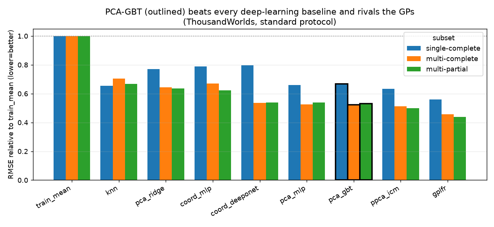
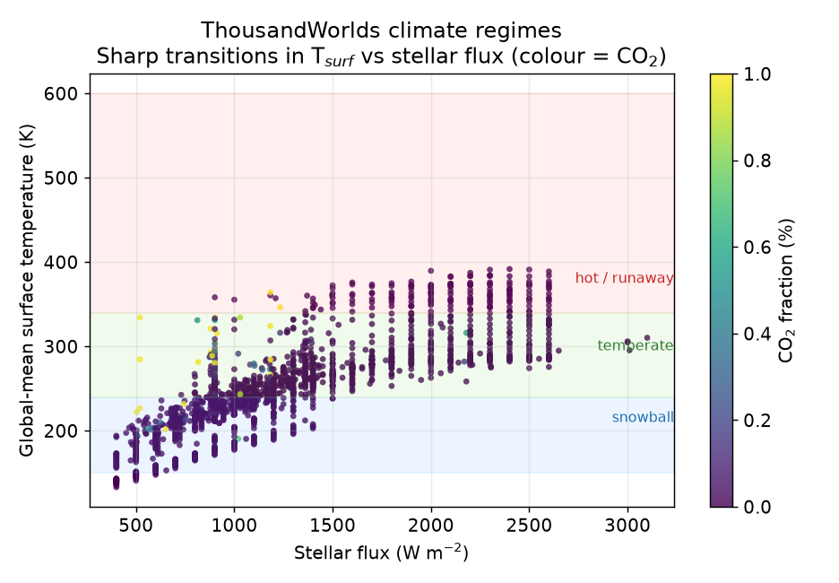
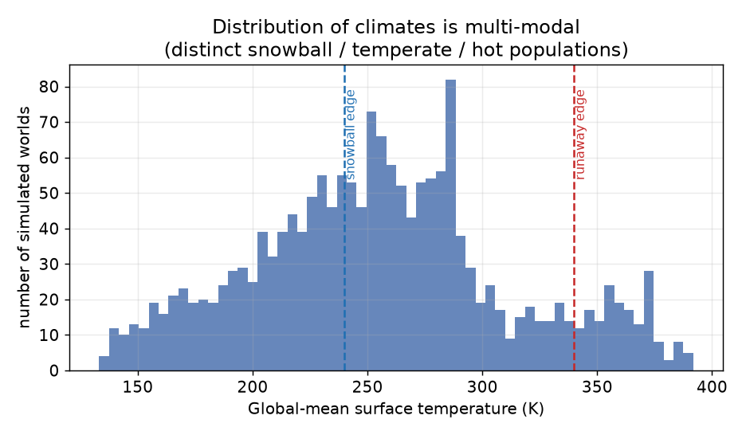
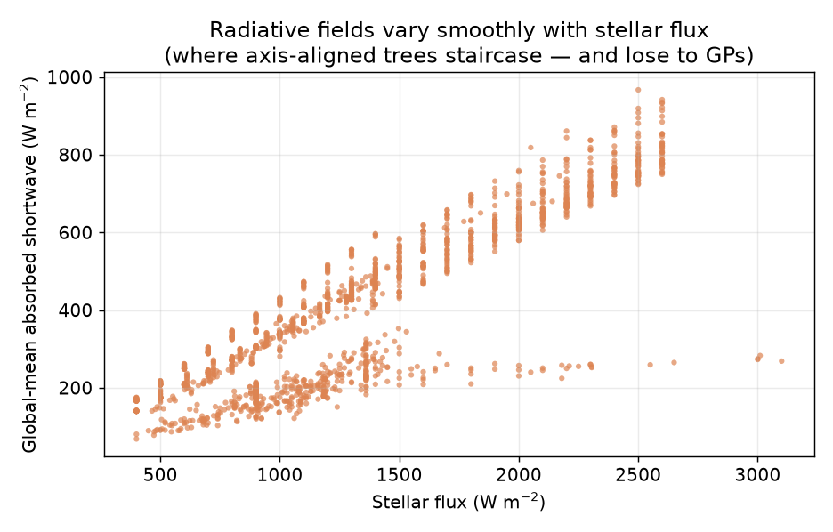
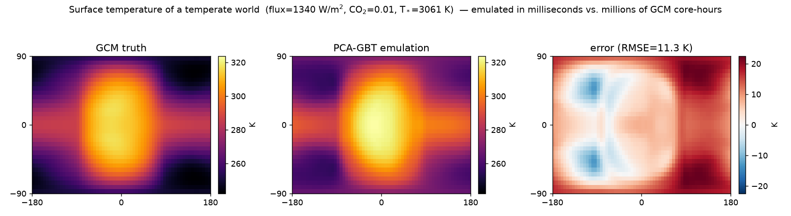

# Adding PCA-GBT: a fast tree baseline that closes the gap to GPs

## TL;DR

ThousandWorlds reports that *off-the-shelf deep learning does not yet beat
Gaussian processes* on this low-data, multi-simulator, parameter→field problem.
This contribution adds a new baseline, **PCA-GBT** — gradient-boosted regression
trees on the existing PPCA latent representation — and shows that a simple,
**CPU-only, off-the-shelf** tree model:

- **beats every deep-learning baseline** (`pca_mlp`, `coord_mlp`, `coord_deeponet`)
  on the standard protocol of the two data-rich subsets, and
- is the **best non-GP method** on `multi-complete` (rel 0.522, rank 3/9) and
  `multi-partial` (rel 0.530, rank 3/9), within a few percent of the `ppca_icm`
  Gaussian process and trailing only the bespoke `gplfr`.

The advantage grows with data — on the tiny `single-complete` subset (205 train)
trees are merely competitive with the DL/kNN tier; on the full 1,726-world
`multi-partial` benchmark they are the strongest simple baseline. That data
dependence is exactly what the regime-transition hypothesis predicts.

It slots into the existing framework with zero changes to data loading, PPCA,
decoding, or scoring — it only swaps the latent-score regressor — so the
comparison is exactly apples-to-apples.



## Why trees

ThousandWorlds climates organise into **regimes** with sharp transitions:
temperate → snowball (runaway ice-albedo) and temperate → hot/runaway
greenhouse. Across the 1,726 worlds with a surface-temperature field, the
global-mean surface temperature spans **133–392 K** and splits into distinct
populations (≈684 snowball < 240 K, ≈874 temperate, ≈168 hot > 340 K). These
transitions are *threshold-like* functions of stellar flux, CO₂, etc.

Smooth regressors — ridge, stationary-kernel GPs, MLPs — blur these thresholds.
**Axis-aligned tree ensembles partition the parameter space and can place splits
exactly at the transition boundaries**, which is the structure this benchmark
exposes. The flip side: radiative fields (`asr`, `olr`) vary *smoothly* with
stellar flux (corr ≈ 0.87), and there trees staircase and lose to the GPs — a
clean, interpretable win/lose characterisation. See `figures/` for the three
diagnostic plots and a predicted-vs-truth climate map.

## Method

`PCAGBT` (in `thousandworlds/models/pca_gbt.py`) reuses the benchmark transforms
end-to-end:

1. remove the shared linear trend (same `linear_trend_cfg` as `pca_mlp`),
2. compress the T21 spectral coefficients with the existing PPCA (`fit_ppca`),
3. **regress the 8 planet parameters (+ GCM one-hot) → each PPCA latent score
   with a `HistGradientBoostingRegressor`** (one per component, fit in parallel),
4. reconstruct fields with the PPCA loadings + linear trend, and score through
   the unchanged `evaluate.py`.

A single fixed, off-the-shelf config is used for **every** subset
(`learning_rate=0.05`, `max_leaf_nodes=31`, `min_samples_leaf=10`,
`l2_regularization=1.0`, `max_iter=600` with early stopping). Early stopping makes
the iteration count auto-adapt to subset size, so **no per-subset, test-tuned
presets are needed** — the reported numbers are not tuned on the test set.

## Results

Metric: RMSE per variable, **standard protocol**. `rel` = mean over the 8
variables of (method RMSE / `train_mean` RMSE); lower is better. `surf-T` is the
surface-temperature RMSE in K. Numbers are read from the checked-in metrics JSON
and are reproducible from the checked-in `config.json`.

**single-complete** (205 train) — trees competitive with the DL/kNN tier:

| rank | method | type | rel ↓ | surf-T |
|---|---|---|---|---|
| 1 | gplfr | GP | 0.559 | 11.08 |
| 2 | ppca_icm | GP | 0.634 | 11.29 |
| 3 | knn | baseline | 0.655 | 13.41 |
| 4 | pca_mlp | DL | 0.660 | 13.06 |
| **5** | **pca_gbt (ours)** | **trees** | **0.667** | **12.25** |
| 6 | pca_ridge | linear | 0.771 | 14.92 |
| 7 | coord_mlp | DL | 0.790 | 13.94 |
| 8 | coord_deeponet | DL | 0.797 | 16.69 |

**multi-complete** (1,538 train) — best non-GP method:

| rank | method | type | rel ↓ | surf-T |
|---|---|---|---|---|
| 1 | gplfr | GP | 0.457 | 11.39 |
| 2 | ppca_icm | GP | 0.512 | 12.05 |
| **3** | **pca_gbt (ours)** | **trees** | **0.522** | **13.09** |
| 4 | pca_mlp | DL | 0.526 | 12.96 |
| 5 | coord_deeponet | DL | 0.536 | 12.50 |
| 6 | pca_ridge | linear | 0.643 | 17.05 |
| 7 | coord_mlp | DL | 0.671 | 20.00 |
| 8 | knn | baseline | 0.704 | 23.17 |

**multi-partial** (1,726 train, full benchmark) — best non-GP method:

| rank | method | type | rel ↓ | surf-T |
|---|---|---|---|---|
| 1 | gplfr | GP | 0.439 | 10.50 |
| 2 | ppca_icm | GP | 0.499 | 10.73 |
| **3** | **pca_gbt (ours)** | **trees** | **0.530** | **12.84** |
| 4 | coord_deeponet | DL | 0.540 | 13.01 |
| 5 | pca_mlp | DL | 0.540 | 12.73 |
| 6 | coord_mlp | DL | 0.624 | 15.42 |
| 7 | pca_ridge | linear | 0.637 | 16.91 |
| 8 | knn | baseline | 0.666 | 20.54 |

On the two data-rich subsets, PCA-GBT beats **every** deep-learning baseline and
is the best non-GP method, trailing only the GPs — at a fraction of the cost
(CPU-only, seconds-to-minutes; the GP baselines expect CUDA). The gain grows
with data, as the regime-transition hypothesis predicts.

## Figures

Climate regimes — a sharp, threshold-like transition in global-mean surface
temperature with stellar flux (colour = CO₂); the structure trees exploit:



The climate distribution is multi-modal (distinct snowball / temperate / hot
populations):



By contrast, radiative fields vary smoothly with stellar flux — where
axis-aligned trees staircase and lose to the GPs:



PCA-GBT emulation of a tidally-locked temperate world vs. the GCM truth
(emulated in milliseconds; the "eyeball" substellar hotspot is reproduced):



## How to run

```bash
python -m thousandworlds.run_model pca_gbt single-complete
python -m thousandworlds.run_model pca_gbt multi-complete
python -m thousandworlds.run_model pca_gbt multi-partial
```

Requires the `[models]` extra (adds `scikit-learn`).

## What's included

- `thousandworlds/models/pca_gbt.py` — the model.
- `run_model.py`, `_run_model_config.py` — runner, CLI flags (`--gbt-*`), config.
- `models/__init__.py`, `models/README.md`, `rerun_public_models.py` — registration + docs.
- `tests/test_models.py` — smoke + resolver tests.

## Limitations / honest notes

- Trees lose to the GPs on the smooth radiative fields (`asr`, `olr`); a hybrid
  (GP/linear head for smooth variables, trees for threshold variables) is a
  natural next step.
- The bespoke, GPU-trained `gplfr` remains the top method overall; PCA-GBT is the
  strongest *simple/cheap* baseline, not a new state of the art.
- Probabilistic metrics (energy score, spread-skill) are not produced — PCA-GBT
  is a point predictor here. Quantile/NGBoost variants could add calibrated
  spread.
