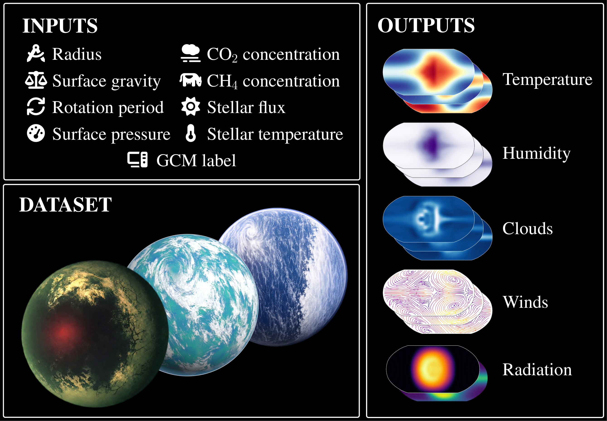

# ThousandWorlds


[](LICENSE)
[](https://doi.org/10.57967/hf/8695)
[](pyproject.toml)

The search for life beyond Earth depends on the molecular signatures it leaves
behind in the atmospheres of habitable exoplanets. Correctly interpreting these
signatures requires understanding the planet's climate. **ThousandWorlds** is a
benchmark for emulating these exoplanet climates: **1760 GCM simulations**
across 5 GCMs, 8 planet parameters, and atmospheric variables on a 32 x 64 x 10
latitude-longitude-pressure grid. It includes three nested benchmark subsets,
two evaluation protocols, and eight released baseline methods.

<br>



## Quickstart

```bash
pip install -e .
```

```python
import numpy as np
import thousandworlds as tw

tw.download_dataset(".")
bundle = tw.load("single-complete", data_dir="dataset")

pred = np.broadcast_to(bundle.Y_train.mean(axis=0), bundle.Y_test.shape)
scores = tw.evaluate.rmse(pred, bundle.Y_test, bundle.field_mask_test, bundle.field_names)
scores["per_variable"]
```

See [`notebooks/quickstart.ipynb`](notebooks/quickstart.ipynb) for a short
walkthrough.

## Installation

```bash
pip install -e .              # core: data loading + evaluation
pip install -e '.[models]'    # baseline model dependencies
pip install -e '.[notebooks]' # notebook dependencies
```

## Dataset

The benchmark dataset is hosted on
[Hugging Face](https://doi.org/10.57967/hf/8695). The
repository already contains metadata and directory layout; this fills in the
large array files:

```bash
python -c "import thousandworlds as tw; tw.download_dataset('.')"
```

Published baseline prediction results are distributed as separate archives:

```bash
python -c "import thousandworlds as tw; tw.download_baselines('.')"
```

## Running Baselines

```bash
python -m thousandworlds.run_model train_mean single-complete
python -m thousandworlds.run_model --config results/models/multi-partial/pca_mlp/config.json
```

Runs write predictions, metrics, and the resolved config under
`results/models/<subset>/<method>/`. The checked-in configs can be rerun with
`--config`; GPLFR configs expect CUDA.

## Repo Structure

```
thousandworlds/
  data.py               # download + load 
  preprocessing.py      # input/output transforms, normalization
  spectral.py           # spectral coefficients <-> gridded fields
  evaluate.py           # RMSE, ACC, energy score, spread-skill ratio, etc.
  run_model.py          # CLI entry point
  make_model_tables.py  # regenerate result tables
  models/               # baseline implementations
  assets/               # precomputed SHT matrix, latitude weights

dataset/                # inputs.csv, subset CSVs, arrays after download
results/                # configs, metrics, published tables
notebooks/              # quickstart, pca_mlp worked example
tests/                  # test suite
```

## Citation

If you use ThousandWorlds, please cite the paper:

```bibtex
@misc{thousandworlds2026,
  title = {ThousandWorlds: A Benchmark for Exoplanet Climate Emulation},
  author = {{ThousandWorlds authors}},
  year = {2026},
  note = {Manuscript in preparation}
}
```
